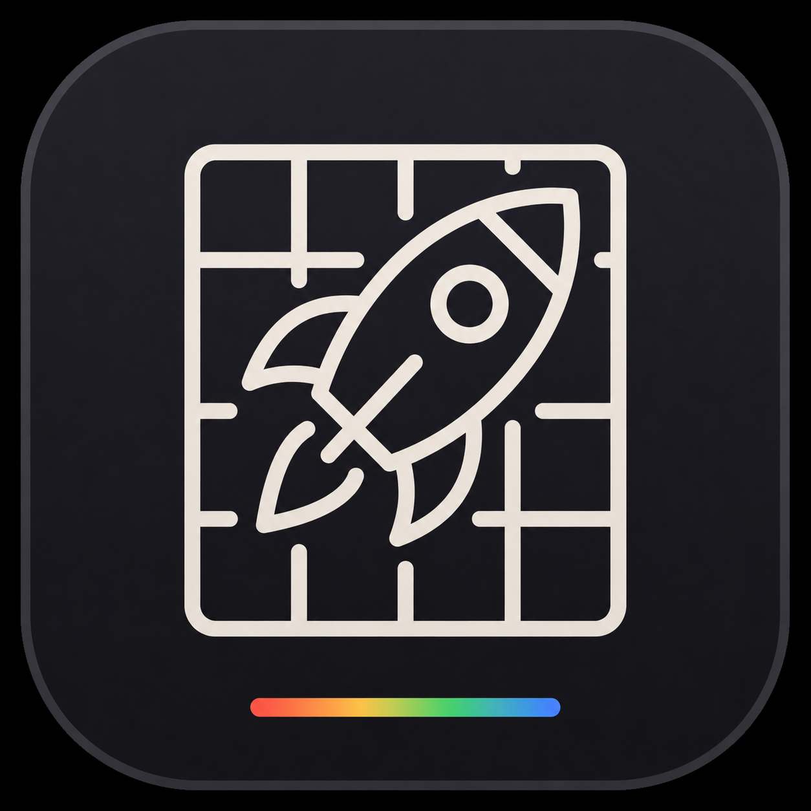

# Xe Computer

<p align="center">
  
</p>

Xe Computer is a local development environment for building and running web
apps on macOS. This repository contains Xe Launcher, the menu bar app that
installs and manages Xe Computer, its browser runtime, and local Compose
services.

## Requirements

### Hardware

- Apple Silicon Mac running macOS Tahoe.

### Experience

- Familiarity with web code/IDE/agentic environments.

## Install

1. Download the [latest Xe Computer release](https://github.com/Agent54/xe-computer-launcher/releases/latest).
2. Open the `Xe-Launcher.dmg` file.
3. Drag the `Xe Launcher` icon to the Applications folder.
4. Open Xe Launcher. It appears in the menu bar and starts Xe Computer.

> [!NOTE]
> If the package cannot open, launch Terminal and type `xattr -d com.apple.quarantine "Xe-Launcher.dmg"` to bypass Gatekeeper.

## Compose

On first launch, choose a folder for your Compose projects. The IWA UI provides
access to Compose. Its server runs on your Mac and stays available during VM
restarts; container operations resume when the VM is ready.

On first launch, the folder dialog offers standard web ports 80/443 when both
are available. Without that selection, the shared listeners use the previous
HTTP port 5196 and HTTPS port 5194. The Compose UI and app links use the same
listener port and protocol. Open the UI at `http://compose-ui.localhost/` or
`https://compose-ui.localhost/`; on fallback ports, use `:5196` or `:5194`
respectively.
If 80/443 were selected but the port helper is unavailable, Xe Launcher keeps
that selection and reports the public listeners as unavailable; it does not
switch to 5196/5194. Port 8094 remains an internal management/API listener,
not an alternate Compose UI address.

Access running services at `http://<service>.localhost/` when using port 80,
or `http://<service>.localhost:5196/` with the fallback. Use
`<service>_<project>` when projects share a service name. The default is the first
TCP port in the Compose `ports` list. Select a specific published port with
`<service>.8080.localhost`, or a [named port](workerd/README.md#port-routes) with
`<service>.web.localhost` (on the selected shared HTTP port). HTTPS services
use the selected shared HTTPS port and keep TLS termination in the container.
HTTP services also work from the shared HTTPS listener. Their HTTPS UI links
use `<service>_<project>.app.localhost` on that same port, where Workerd
terminates TLS with a generated local certificate. HTTPS services keep their
existing `<service>_<project>.localhost` names and container certificates.

On first launch, Xe Launcher generates a private local certificate authority
and a server certificate for `compose-ui.localhost` and single-label
`*.app.localhost` HTTP app names. Xe Launcher asks macOS to trust this
certificate for SSL for the current user; approve the authentication prompt to
finish setup. If you decline, Xe Launcher offers a retry and asks again on its
next launch. The certificate is stored at
`~/Library/Application Support/dev.xe.computer/workerd/ui-https/root.crt`.
This user-level trust also applies to other browsers. Its private key remains
in the launcher state directory with owner-only permissions; the server
certificate renews without another prompt. HTTPS container apps still present
their own certificates, which must be trusted separately.

When standard ports are selected, a small Swift `launchd` helper reserves only `127.0.0.1:80` and
`127.0.0.1:443` after administrator approval. It hands those listening sockets
to the unprivileged Workerd process; it does not handle app traffic or TLS.
Approve the helper in System Settings → General → Login Items & Extensions and
restart Xe Launcher. The management UI remains available while approval is
pending, but standard-port app URLs do not.

To override the shared app listener ports without adding UI controls, set
`app_http_port` and `app_https_port` in
`~/Library/Application Support/dev.xe.computer/settings.json`, then restart the
launcher. Defaults are 5196 and 5194; custom ports must be at least 1024 and at
most 65535, except for the supported 80/443 pair. The launcher checks direct-bind
ports at startup and warns if they are unavailable. App URLs include a port
when the selected port is nonstandard.
Mixed standard/custom pairs are rejected and reset to the default pair. Set
both ports above 1023 to disable the helper.

The container VM uses at least 4096 MiB of elastic memory. Advanced users can
raise the limit by setting `container_vm_memory_mib` in
`~/Library/Application Support/dev.xe.computer/settings.json` (up to 32768) and
restarting Xe Launcher. The launcher monitors Docker after startup and performs
a bounded VM restart if the daemon becomes unavailable; the menu status and
Compose API expose whether recovery was caused by an out-of-memory event.

## Building from source

Follow the [development setup](https://github.com/Agent54/xe-darc/blob/main/INSTALL.md).
You also need Deno 2 and an authenticated GitHub CLI with read access to
`Agent54/smol-compose`, `Agent54/compose-server`, and `Agent54/compose-ui`.

For a local macOS build, download and extract the `guest-worker` artifact from
a CI run for the same source revision:

```sh
make -C macos BUILD_CONFIG=debug GUEST_ROUTER_ASSET_DIR=/path/to/guest-worker bundle
```

To build from a local Compose UI checkout, explicitly set
`COMPOSE_UI_SOURCE_DIR=/absolute/path/to/darc-worker/svelte` when running
`make`. Otherwise the build uses the checksum-pinned release. CI uses that
release until `macos/ComposeUI.lock` is updated to one containing the matching
shared-domain links.

CI builds the guest worker and macOS app together. See [worker development](workerd/README.md)
and [integration tests](macos/Tests/Integration/README.md) for contributor details.

## Updates

Installed copies use Sparkle for signed in-app updates. Release maintainers
should follow [the updater setup and release guide](macos/UPDATES.md).

The browser engine is updated independently from the launcher. The current pin
is Helium 0.17.2.1 (Chromium 153.0.8010.52); the launcher verifies the published
checksum and Developer ID signature before replacing the engine while keeping
browser profiles intact. Engines live under versioned
`helium/VERSION/Helium.app` paths so a failed download or validation leaves the
previous engine available.

Xe Computer IWA releases retain their real, monotonically increasing manifest
versions. While the managed browser is stopped, the launcher verifies the
configured release version and Web Bundle ID, then atomically replaces
Chromium's profile-owned `main.swbn`. Chromium's
internal registry is intentionally not patched. The effective version and
SHA-256 shown in the launcher's About panel are derived live by comparing the
profile bundle with the configured versioned source asset. No additional state
file is maintained. The versioned source bundles remain available for rollback.
