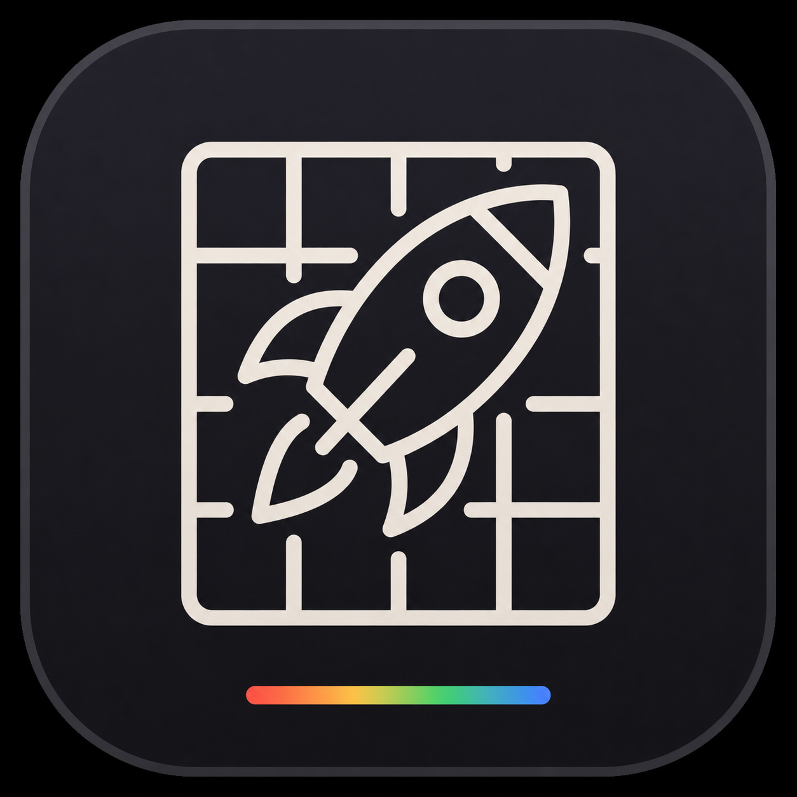

# Xe Computer

<p align="center">
  
</p>

Xe Computer is a local development environment for building and running web
apps on macOS. This repository contains Xe Launcher, the menu bar app that
installs and manages Xe Computer, its browser runtime, and local Compose
services.

## Requirements

### Hardware

- Apple Silicon Mac running macOS Tahoe.

### Experience

- Familiarity with web code/IDE/agentic environments.

## Install

1. Download the [latest Xe Computer release](https://github.com/Agent54/xe-computer-launcher/releases/latest).
2. Open the `Xe-Launcher.dmg` file.
3. Drag the `Xe Launcher` icon to the Applications folder.
4. Open Xe Launcher. Every launch first shows an experimental software warning.
   Only use Xe Computer with fresh folders that contain no important data, and
   do not use it on websites with real accounts. Choose Continue to start the
   launcher in the menu bar and start Xe Computer, or Cancel to quit before setup
   or services start.

> [!NOTE]
> If the package cannot open, launch Terminal and type `xattr -d com.apple.quarantine "Xe-Launcher.dmg"` to bypass Gatekeeper.

## Compose

On first launch, choose a folder for your Compose projects. The IWA UI provides
access to Compose. Its server runs on your Mac and stays available during VM
restarts; container operations resume when the VM is ready.
During boot or recovery, Docker-dependent public API calls return a retryable
503 with runtime status immediately. Compose's schema, ping, repository checkout
and UI remain available.

The selected folder is shared with SmolVM at `/stacks`. Compose resolves
relative binds and `${STACKS_PATH}` on the Mac, then translates their sources
to `/stacks/...` before creating containers. File-backed configs and secrets
use the same mapping. Builds and Compose file discovery run on the Mac.
Host bind sources outside the selected folder are rejected; guest Docker
socket/storage paths and timezone files keep their guest paths. The Compose
API socket lives in launcher app data, outside the shared stacks folder.

In launcher mode, project paths and their symlink targets must resolve inside
the selected folder, and default Compose file lookup stays in the requested
directory. Compose configurations remain trusted host input: env files,
includes and build contexts can still reference host resources outside that
folder. The mount and project-path checks do not sandbox those reads.

On first launch, the folder dialog offers standard web ports 80/443 when both
are available. Without that selection, the shared listeners use the previous
HTTP port 5196 and HTTPS port 5194. The Compose UI and app links use the same
listener port and protocol. Open the UI at `http://compose-ui.localhost/` or
`https://compose-ui.localhost/`; on fallback ports, use `:5196` or `:5194`
respectively.
If 80/443 were selected but the port helper is unavailable, Xe Launcher keeps
that selection and reports the public listeners as unavailable; it does not
switch to 5196/5194. Port 8094 remains an internal management/API listener,
not an alternate Compose UI address.

Access running services at `http://<service>.localhost/` when using port 80,
or `http://<service>.localhost:5196/` with the fallback. Use
`<service>_<project>` when projects share a service name. The default is the first
TCP port in the Compose `ports` list. Select a specific published port with
`<service>.8080.localhost`, or a [named port](workerd/README.md#port-routes) with
`<service>.web.localhost` (on the selected shared HTTP port). HTTPS services
use the selected shared HTTPS port and keep TLS termination in the container.
HTTP services also work from the shared HTTPS listener. Their HTTPS UI links
use `<service>_<project>.app.localhost` on that same port, where Workerd
terminates TLS with a generated local certificate. HTTPS services keep their
existing `<service>_<project>.localhost` names and container certificates.
The Xe Computer launcher links to each published port using
`https://<service>_<project>--n<name>.app.localhost` for named ports, or
`https://<service>_<project>--p<published>.app.localhost` for numeric ports, on
the selected HTTPS port. An HTTPS service redirects from that alias to its
container TLS route.

On first launch, Xe Launcher generates a private local certificate authority
and a server certificate for `compose-ui.localhost` and single-label
`*.app.localhost` HTTP app names. Xe Launcher asks macOS to trust this
certificate for SSL for the current user; approve the authentication prompt to
finish setup. If you decline, Xe Launcher offers a retry and asks again on its
next launch. The certificate is stored at
`~/Library/Application Support/dev.xe.computer/workerd/ui-https/root.crt`.
This user-level trust also applies to other browsers. Its private key remains
in the launcher state directory with owner-only permissions; the server
certificate renews without another prompt. HTTPS container apps still present
their own certificates, which must be trusted separately.

When standard ports are selected, a small Swift `launchd` helper reserves only `127.0.0.1:80` and
`127.0.0.1:443` after administrator approval. It hands those listening sockets
to the unprivileged Workerd process; it does not handle app traffic or TLS.
Approve the helper in System Settings → General → Login Items & Extensions and
restart Xe Launcher. The management UI remains available while approval is
pending, but standard-port app URLs do not.

To override the shared app listener ports without adding UI controls, set
`app_http_port` and `app_https_port` in
`~/Library/Application Support/dev.xe.computer/settings.json`, then restart the
launcher. Defaults are 5196 and 5194; custom ports must be at least 1024 and at
most 65535, except for the supported 80/443 pair. The launcher checks direct-bind
ports at startup and warns if they are unavailable. App URLs include a port
when the selected port is nonstandard.
Mixed standard/custom pairs are rejected and reset to the default pair. Set
both ports above 1023 to disable the helper.

Hold Option while opening the launcher menu to change **Container VM Memory**,
**Container VM CPUs**, or **Container VM Disk Size**. These limits are shared by Docker builds and all
containers; changes take effect after quitting and reopening Xe Launcher, which
restarts the VM. Memory defaults to 4 GiB and accepts 4–32 GiB; CPU allocation
defaults to 2 and accepts 1 up to the Mac's logical CPU count. Memory is elastic:
only touched memory is committed. The equivalent settings are
`container_vm_memory_mib` (4096–32768 MiB) and `container_vm_cpus` in
`~/Library/Application Support/dev.xe.computer/settings.json`.
The Docker data disk defaults to 20 GiB and can grow up to 4096 GiB; it cannot
shrink. Its setting is `container_vm_disk_gib`. Existing larger disks are
preserved even if this setting is lowered manually. Growth applies on restart
and does not preallocate the entire capacity on the Mac.

Click **VM DISK FREE** in the Compose UI to open disk usage. The page shows
guest free space, free inodes, host image allocation, and a Docker inventory
from metadata, cached for one minute. **Analyze disk usage** explicitly runs
Docker's filesystem scan, with a 60-second deadline, one shared request, and a
five-minute result cache. No analysis runs on a timer. Reports show images,
writable container layers, volumes, and build cache, largest objects first,
with conservative reclaimable estimates. Shared layers are not additive;
logs, filesystem overhead, and host bind mounts are outside Docker's report.
Unused volumes are review candidates and may hold important persistent data.
The page does not delete data.

Docker defaults to the `local` logging driver with three rotating 10 MB files
per container. Before starting Docker, the launcher prepares the host-owned
`smol/docker-config/daemon.json` and mounts its directory read-only at
`/etc/docker`. New and existing VMs receive the same mount before boot; no guest
installation script or extra configuration restart is needed. The daemon's
PID-file path is fixed at `/run/docker.pid`. Other settings
in the host configuration are preserved. Docker's boot-time container restart
is disabled (`restart: false`). The launcher retains an explicit startup list
in `compose_startup_services`, empty by default. Each entry supplies `project`,
`service` and `path` (the Compose configuration path). Swift publishes the list
and VM boot identifier and notifies a private workerd listener when runtime
status changes. One workerd coordinator owns both configured startup and
request-driven starts from the HTTP and TLS gateways. It starts the list once
per VM boot, after Docker and Compose answer their readiness probes, and saves
attempts in private launcher state so restarting workerd does not replay them.
Service starts run in the background so they do not block management, routing
or monitoring. VM shutdown/recovery cancels pending work. Services outside the
list wait for an app request or scheduler action. Their restart policies still handle
crashes after that explicit start. The mounted configuration also contains a
small `startup/find` wrapper placed first on the guest PATH. It replaces DinD's
exact stale-PID search with removal of `/run/docker.pid`, the daemon's configured
PID file, only when it is a regular file and not a symlink. Startup does not
search subdirectories or remove other PID files. Other `find` commands retain
their normal behavior. SmolVM socket forwarding connects inside the workload's
filesystem without sharing the VM's `/run` directory. This requires a runtime
built with the socket mount fix; the launcher wrapper also limits cleanup on
older runtimes. Existing containers adopt the logging defaults
when recreated; explicit Compose logging settings take precedence. BuildKit automatically collects unused
build cache with a 5 GB maximum and a 1 GB reserve, using Docker's standard GC
policies. Collection is periodic; cache in use by active builds can exceed the
target.

Runtime maintenance is centralized in `ContainerRuntimeMaintenance.swift`:
logging limits, the build-cache budget, and image cleanup. While Docker is
healthy, the launcher runs `docker image prune --all --force --filter until=32h`
every four hours, removing both dangling and tagged unused images older than
32 hours. The cutoff uses image creation time. Images referenced by running or stopped
containers are preserved, as are containers and volumes. The first healthy
startup runs cleanup; subsequent attempts are
recorded in `smol/maintenance.json`, so restarting the app does not reset the
interval. Missed runs resume when Docker is healthy, without waking a stopped
VM. Shutdown and VM recovery cancel an active cleanup. Results are logged under
`maintenance`.

Build with `COMPOSE_UI_SOURCE_DIR=/absolute/path/to/darc-worker/svelte`
to include this page until a new Compose UI release is published and pinned.

The launcher monitors Docker after startup and performs
a bounded VM restart if the daemon becomes unavailable; the menu status and
Compose API expose whether recovery was caused by an out-of-memory event.

## Building from source

Follow the [development setup](https://github.com/Agent54/xe-darc/blob/main/INSTALL.md).
You also need Deno 2 and an authenticated GitHub CLI with read access to
`Agent54/smol-compose`, `Agent54/compose-server`, and `Agent54/compose-ui`.

For a local macOS build, download and extract the `guest-worker` artifact from
a CI run for the same source revision:

```sh
make -C macos BUILD_CONFIG=debug GUEST_ROUTER_ASSET_DIR=/path/to/guest-worker bundle
```

To build from a local Compose UI checkout, explicitly set
`COMPOSE_UI_SOURCE_DIR=/absolute/path/to/darc-worker/svelte` when running
`make`. Otherwise the build uses the checksum-pinned release. CI uses that
release until `macos/ComposeUI.lock` is updated to one containing the matching
shared-domain links.

CI builds the guest worker and macOS app together. See [worker development](workerd/README.md)
and [integration tests](macos/Tests/Integration/README.md) for contributor details.

## Updates

Installed copies use Sparkle for signed in-app updates. Release maintainers
should follow [the updater setup and release guide](macos/UPDATES.md).

The browser engine is updated independently from the launcher. The current pin
is Helium 0.17.2.1 (Chromium 153.0.8010.52); the launcher verifies the published
checksum and Developer ID signature before replacing the engine while keeping
browser profiles intact. Engines live under versioned
`helium/VERSION/Helium.app` paths so a failed download or validation leaves the
previous engine available.

Xe Computer IWA releases retain their real, monotonically increasing manifest
versions. While the managed browser is stopped, the launcher verifies the
configured release version and Web Bundle ID, then atomically replaces
Chromium's profile-owned `main.swbn`. Chromium's
internal registry is intentionally not patched. The effective version and
SHA-256 shown in the launcher's About panel are derived live by comparing the
profile bundle with the configured versioned source asset. No additional state
file is maintained. The versioned source bundles remain available for rollback.
